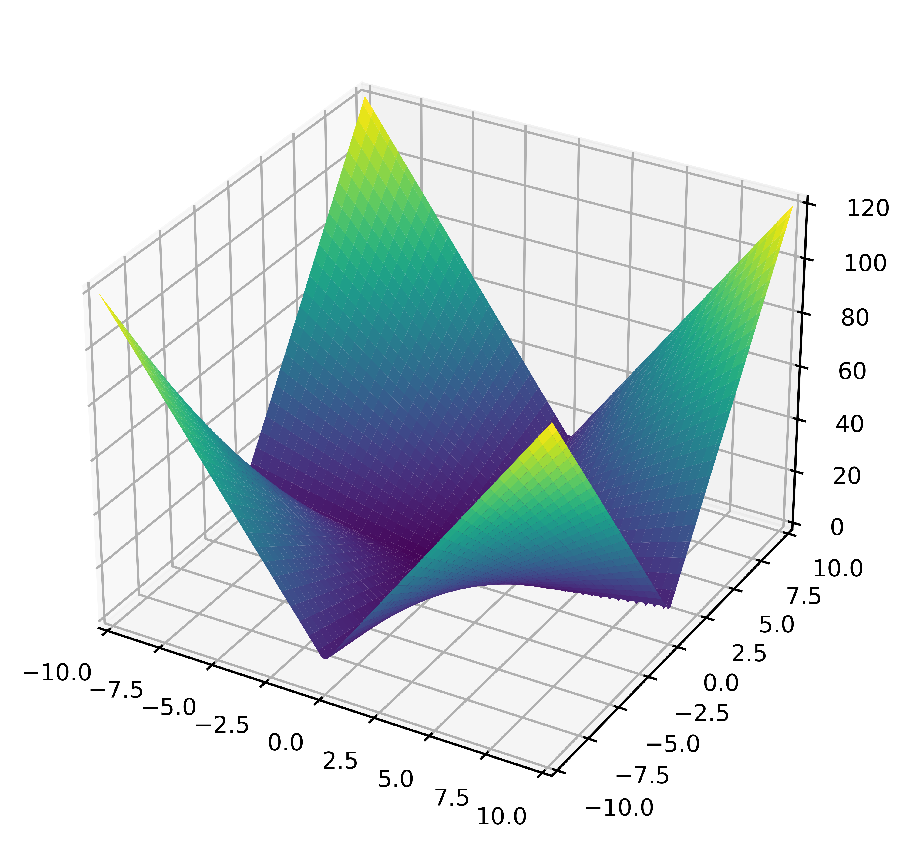
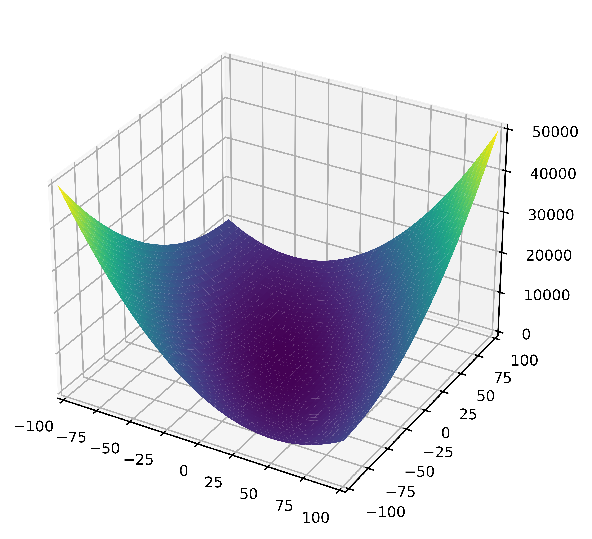
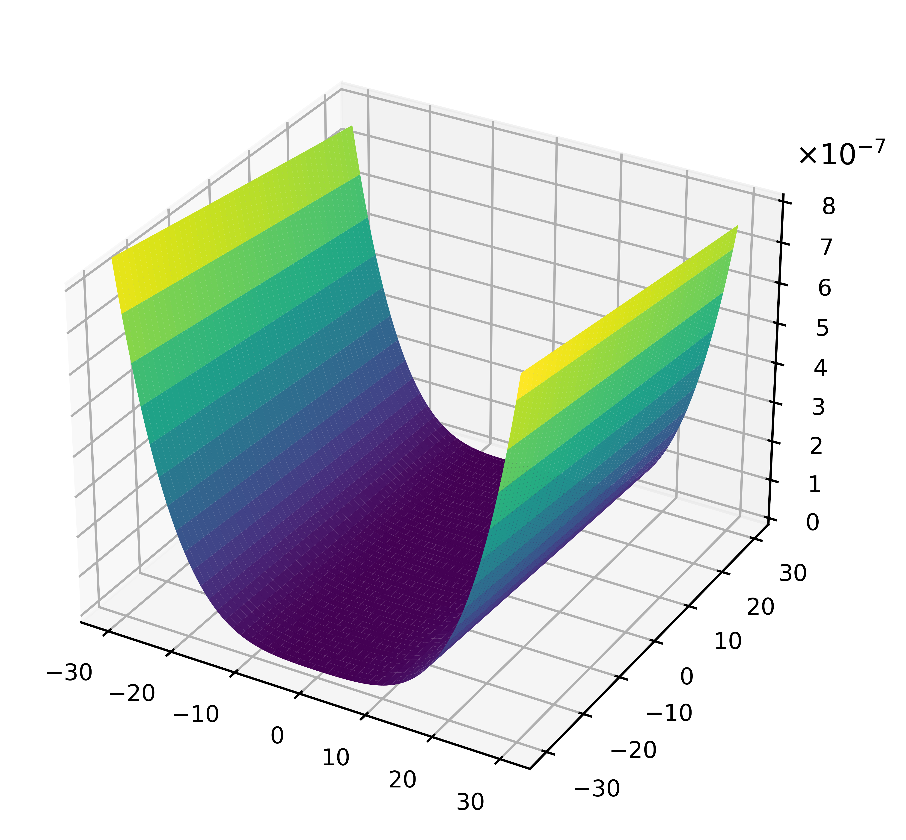
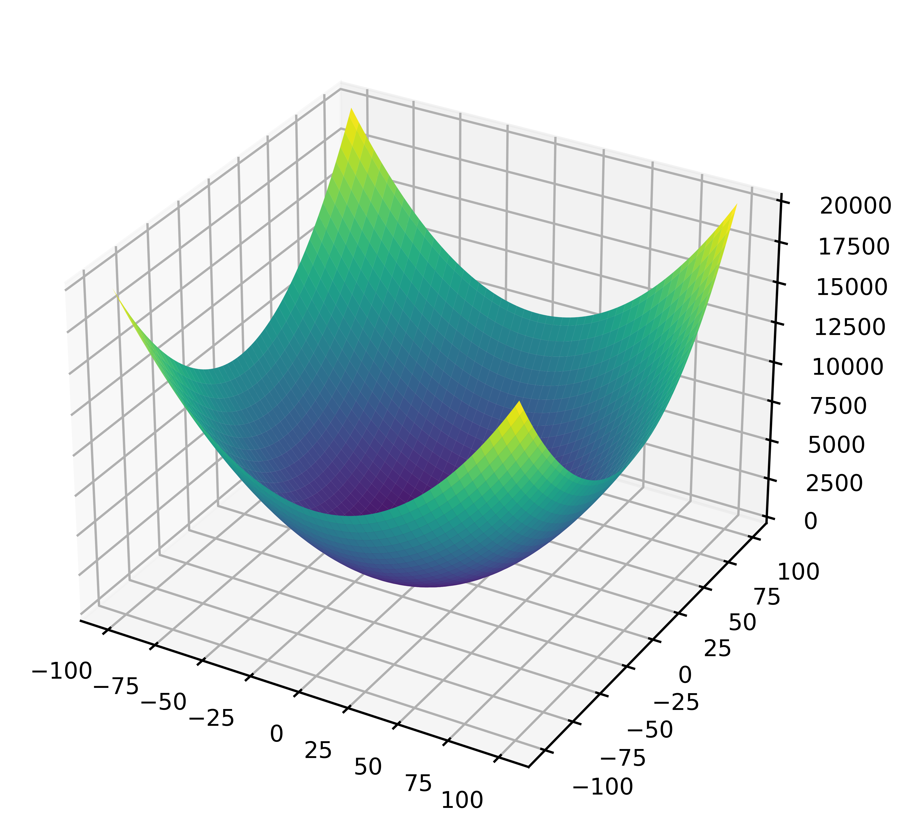
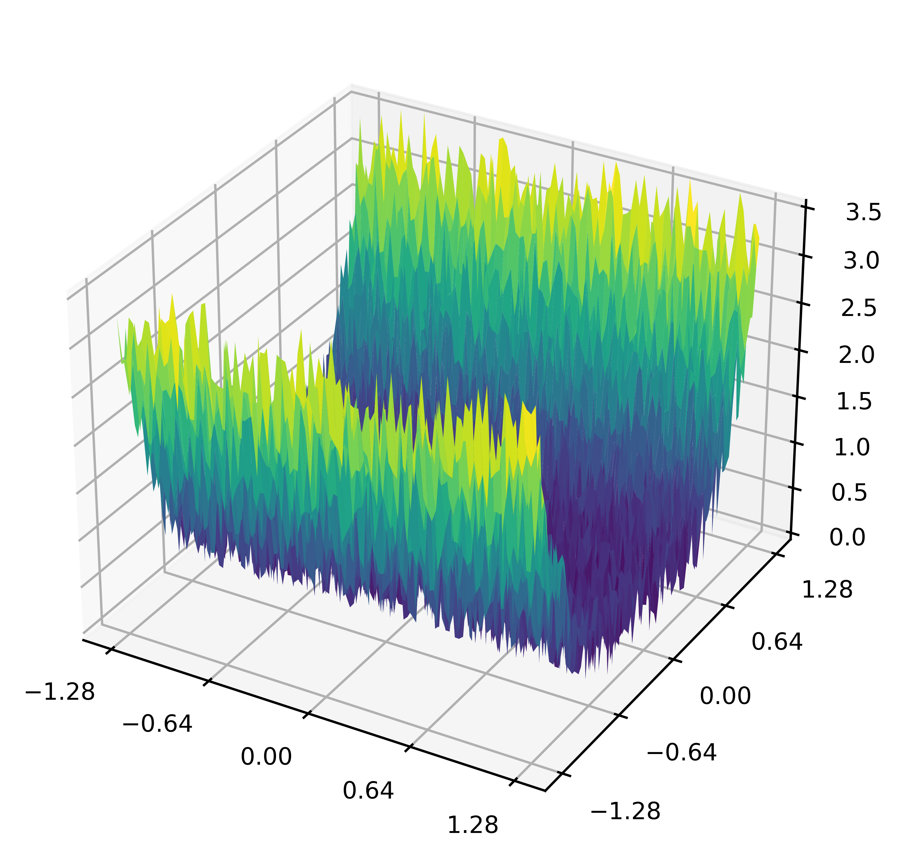
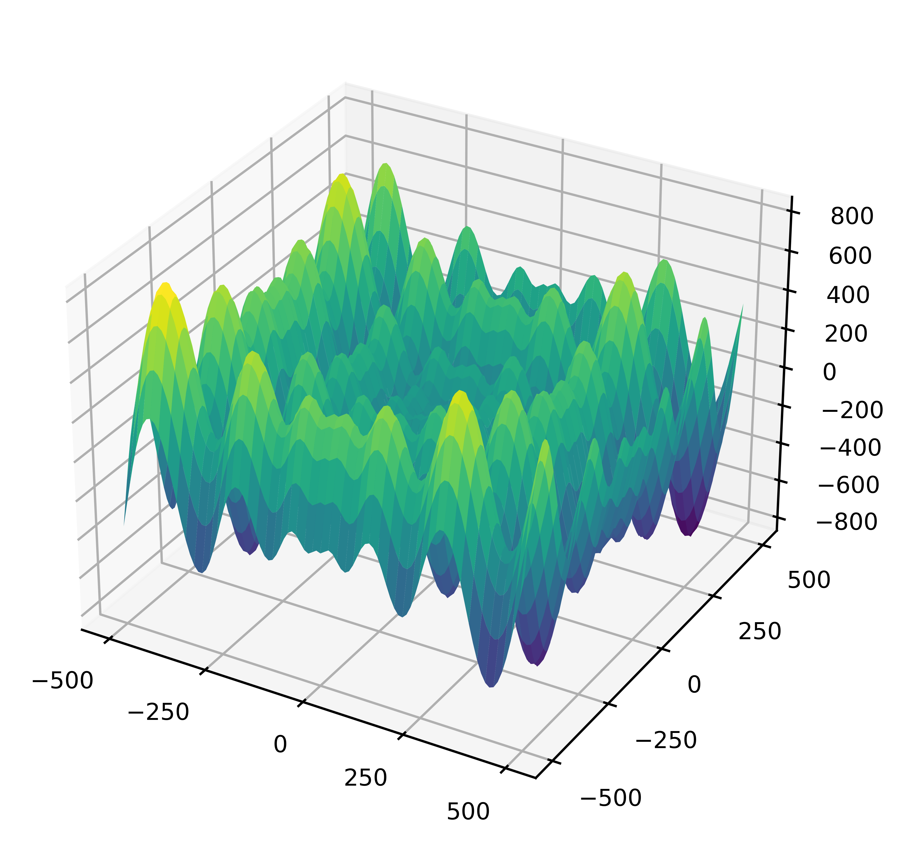
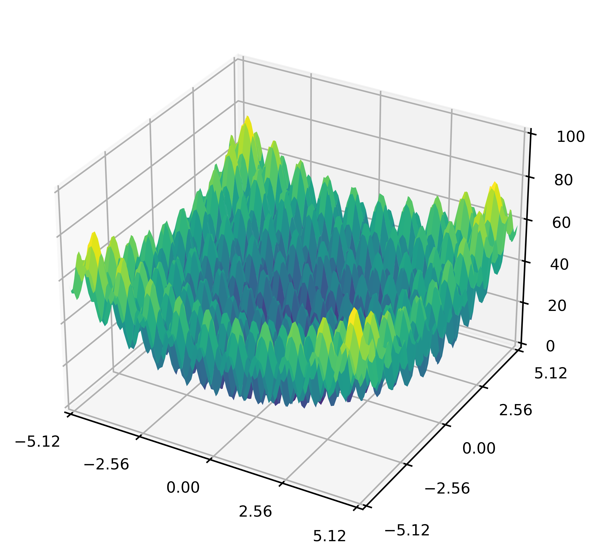
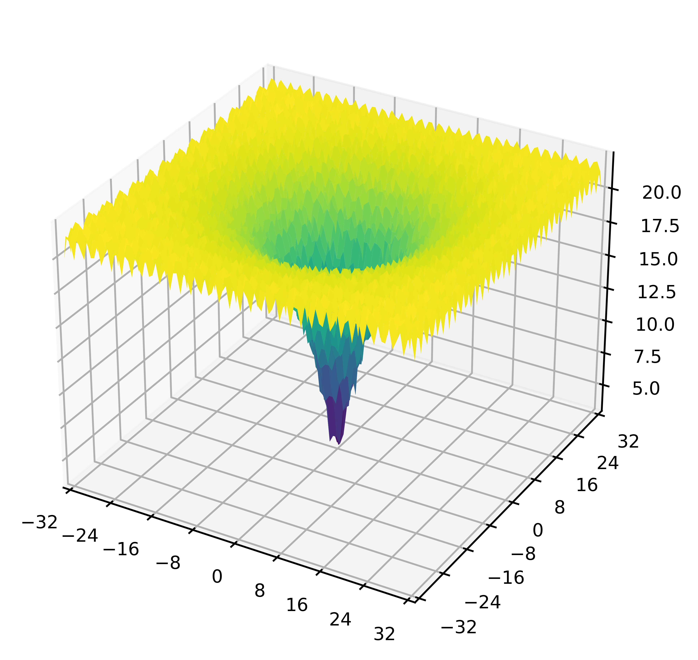
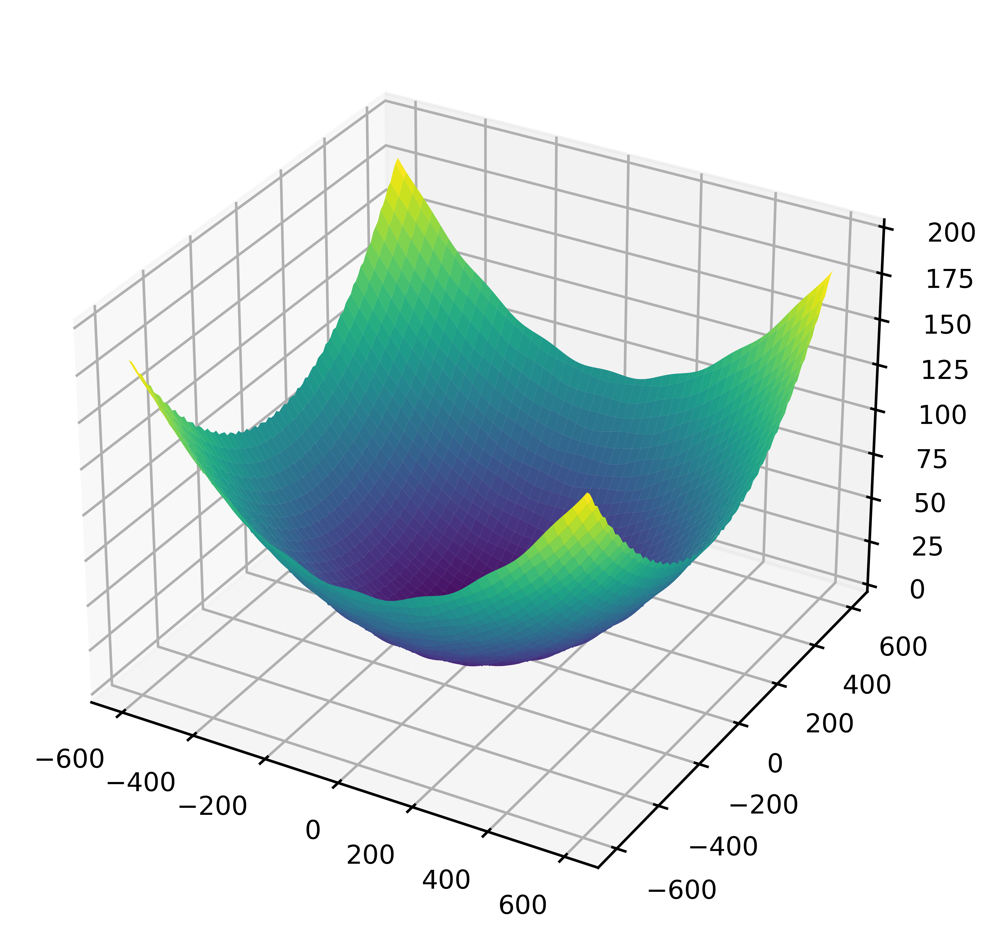

# Benchmark Functions for Optimization Algorithm Validation

This repository contains implementations of various benchmark functions commonly used for validating optimization algorithms. 
These benchmark functions serve as standard test cases to evaluate the performance of optimization algorithms in terms of global optimal convergence and robustness.

## Available Benchmark Functions

1. **Sphere**
2. **Schwefel's 2.22**
3. **Schwefel's 1.20**
4. **Rosenbrock**
5. **Step**
6. **Quartic Noise**
7. **Schwefel's 2.26**
8. **Rastrigin**
9. **Ackley**
10. **Griewank**

## Function Descriptions

1. **Sphere**:
   
   - **Dimension**: $30$
   - **Lower Bound**: $-100$ for all dimensions
   - **Upper Bound**: $+100$ for all dimensions
   - **Global Minimum**: $f(x^{\*}) = 0, \text{at}\space x^{\*} = (0, ..., 0)$

2. **Schwefel's 2.22**:
   
   - **Dimension**: $30$
   - **Lower Bound**: $-10$ for all dimensions
   - **Upper Bound**: $+10$ for all dimensions
   - **Global Minimum**: $f(x^{\*}) = 0, \text{at}\space x^{\*} = (0, ..., 0)$

3. **Schwefel's 1.20**:
   
   - **Dimension**: $30$
   - **Lower Bound**: $-100$ for all dimensions
   - **Upper Bound**: $+100$ for all dimensions
   - **Global Minimum**: $f(x^{\*}) = 0, \text{at}\space x^{\*} = (0, ..., 0)$

4. **Rosenbrock**:
   
   - **Dimension**: $30$
   - **Lower Bound**: $-30$ for all dimensions
   - **Upper Bound**: $+30$ for all dimensions
   - **Global Minimum**: $f(x^{\*}) = 0, \text{at}\space x^{\*} = (1, ..., 1)$

5. **Step**:
   
   - **Dimension**: $30$
   - **Lower Bound**: $-100$ for all dimensions
   - **Upper Bound**: $+100$ for all dimensions
   - **Global Minimum**: $f(x^{\*}) = 0, \text{at}\space x^{\*} = (0.5, ..., 0.5)$

6. **Quartic Noise**:
   
   - **Dimension**: $30$
   - **Lower Bound**: $-1.28$ for all dimensions
   - **Upper Bound**: $+1.28$ for all dimensions
   - **Global Minimum**: $f(x^{\*}) = 0, \text{at}\space x^{\*} = (0, ..., 0)$

7. **Schwefel's 2.26**:
   
   - **Dimension**: $30$
   - **Lower Bound**: $-500$ for all dimensions
   - **Upper Bound**: $+500$ for all dimensions
   - **Global Minimum**: $f(x^{\*}) = -12569.49, \text{at}\space x^{\*} = (420.9687, ..., 420.9687)$

8. **Rastrigin**:
   
   - **Dimension**: $30$
   - **Lower Bound**: $-5.12$ for all dimensions
   - **Upper Bound**: $+5.12$ for all dimensions
   - **Global Minimum**: $f(x^{\*}) = 0, \text{at}\space x^{\*} = (0, ..., 0)$

9. **Ackley**:
   
   - **Dimension**: $30$
   - **Lower Bound**: $-32$ for all dimensions
   - **Upper Bound**: $+32$ for all dimensions
   - **Global Minimum**: $f(x^{\*}) = 0, \text{at}\space x^{\*} = (0, ..., 0)$

10. **Griewank**:
    
    - **Dimension**: $30$
    - **Lower Bound**: $-600$ for all dimensions
    - **Upper Bound**: $+600$ for all dimensions
    - **Global Minimum**: $f(x^{\*}) = 0, \text{at}\space x^{\*} = (0, ..., 0)$
